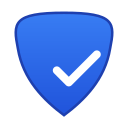

# 🛡️ Privacy Shield Scanner

<div align="center">



**A powerful browser extension that analyzes website privacy and security in real-time.**

[](LICENSE)
[](https://chrome.google.com/webstore)
[](https://github.com/Raouf-Braham/Privacy-Shield-Scanner/releases)
[](https://developer.mozilla.org/en-US/docs/Web/JavaScript)

[Features](#-features) • [Installation](#-installation) • [Usage](#-usage) • [Permissions](#-permissions-explained) • [Contributing](#-contributing)

</div>

---

## 📋 Table of Contents

- [Overview](#-overview)
- [Features](#-features)
- [Demo](#-demo)
- [Installation](#-installation)
- [Usage](#-usage)
- [How It Works](#-how-it-works)
- [Permissions Explained](#-permissions-explained)
- [Project Structure](#-project-structure)
- [Development](#-development)
- [Contributing](#-contributing)
- [License](#-license)
- [Contact](#-contact)

---

## 🌟 Overview

**Privacy Shield Scanner** is a Chrome/Edge browser extension that helps you understand how websites track your online activity.  It analyzes web pages in real-time to detect:

- 👁️ **Tracking scripts** (Google Analytics, Facebook Pixel, etc.)
- 🔍 **Browser fingerprinting** techniques
- 🌐 **Third-party domains** loading resources
- 🍪 **Cookies** and their purposes
- 🔒 **Security issues** (HTTPS, mixed content)

Instantly receive a **privacy score** from 0 to 100 along with actionable recommendations to protect your online privacy.

---

## ✨ Features

### 🎯 Core Features

| Feature | Description |
|---------|-------------|
| **Real-time Analysis** | Automatically analyzes pages as you browse |
| **Privacy Score** | Score from 0-100 with letter grade (A+ to F) |
| **Tracker Detection** | Identifies 200+ common tracking services |
| **Fingerprinting Detection** | Detects canvas, WebGL, and audio fingerprinting |
| **Security Analysis** | Verifies HTTPS and mixed content |
| **Detailed Reports** | Export results to clipboard |

### 🎨 User Experience

- 🌓 **Dark/Light Theme** - Adapts to system preferences
- ⚡ **Fast & Lightweight** - Minimal performance impact
- 📱 **Modern Interface** - Clean and intuitive design
- 🔔 **Badge Notifications** - Score displayed on extension icon
- 📊 **Accordion Details** - Expandable lists for more information
- 📈 **Score History** - Track privacy changes over time

---

## 📸 Demo

<video src="https://github.com/user-attachments/assets/db5bfa57-eb53-443f-b9a1-d94148122c03" controls></video>

### Score Examples

| Score | Grade | Color | Meaning |
|-------|-------|-------|---------|
| 90-100 | A+ | 🟢 Green | Excellent privacy |
| 80-89 | A | 🟢 Green | Very good |
| 70-79 | B | 🟡 Yellow-Green | Good |
| 60-69 | C | 🟡 Yellow | Moderate |
| 50-59 | D | 🟠 Orange | Poor |
| 30-49 | E | 🔴 Red | Bad |
| 0-29 | F | 🔴 Dark Red | Critical |

### Tracker Details

```
┌─────────────────────────────────────┐
│ 👁️ Trackers Detected            3   │
├─────────────────────────────────────┤
│ ┌─────────────────────────────────┐ │
│ │ google-analytics.com  ANALYTICS │ │
│ │ facebook.net          SOCIAL    │ │
│ │ doubleclick.net       ADS       │ │
│ └─────────────────────────────────┘ │
└─────────────────────────────────────┘
```

---

## 🚀 Installation

### Method 1: Manual Loading (Developer Mode)

#### Step 1: Download the Source Code

```bash
git clone https://github.com/Raouf-Braham/Privacy-Shield-Scanner.git
```

Or download and extract the ZIP file from GitHub.

#### Step 2: Open Chrome Extensions

- Open Chrome/Edge
- Type `chrome://extensions/` in the address bar
- Or navigate to Menu → More Tools → Extensions

#### Step 3: Enable Developer Mode

- Toggle the "Developer mode" switch in the top right corner of the page

#### Step 4: Load the Extension

- Click "Load unpacked"
- Select the `Privacy-Shield-Scanner` folder
- The 🛡️ icon should appear in your toolbar

#### Step 5: Pin the Extension (Recommended)

- Click the puzzle icon 🧩 in the toolbar
- Click the pin 📌 next to "Privacy Shield Scanner"

### Method 2: Microsoft Edge Add-ons 

```
🎉 The extension is now live on the Microsoft Edge Add-ons store! 
```
[Privacy Shield Scanner – Microsoft Edge Add-ons](https://microsoftedge.microsoft.com/addons/detail/privacy-shield-scanner/gjcgfbfcendnafkmbjokkkllidbbajdb)

---

## 📖 Usage

### Basic Usage

1.**Navigate** to any website
2. **Wait** 1-2 seconds for the analysis to complete
3. **Click** the 🛡️ icon in the toolbar
4. **Review** your privacy score and details

### Understanding the Results

#### Privacy Score
- **90-100 (A+)**: Excellent!  The site respects your privacy
- **70-89 (A/B)**: Good, some trackers present
- **50-69 (C/D)**: Moderate, several trackers detected
- **0-49 (E/F)**: Poor, numerous trackers and risks

#### Detailed Sections

| Section | Description |
|---------|-------------|
| **Trackers** | List of detected tracking scripts |
| **Fingerprinting** | Browser identification techniques |
| **Third-Party Domains** | Resources loaded from external sites |
| **Security** | HTTPS status and mixed content |

### Available Actions

- **🔄 Rescan**: Re-run the page analysis
- **📋 Copy Report**: Copy a detailed report to clipboard
- **🔗 Share**: Share your results

---

## ⚙️ How It Works

### Analysis Process

```
┌─────────────┐     ┌─────────────┐     ┌─────────────┐
│    Page     │     │   Script    │     │   Service   │
│   Loaded    │ ──▶│  Analyzes    │ ──▶│   Worker    │
│             │     │   the DOM   │     │   Stores    │
└─────────────┘     └─────────────┘     └─────────────┘
                           │                   │
                           ▼                   ▼
                    ┌─────────────┐     ┌─────────────┐
                    │  Detects:   │     │   Badge     │
                    │  - Trackers │     │  Displays   │
                    │  - Scripts  │     │   Score     │
                    │  - Domains  │     │             │
                    └─────────────┘     └─────────────┘
```

### Detection Methods

#### 1.  Tracker Detection

The extension searches for known patterns in:
- Script sources (`<script src="...">`)
- Tracking pixels (``)
- Iframes (`<iframe src="...">`)
- Inline script content
- Noscript fallback content

**Detected Trackers (non-exhaustive list):**

| Category | Examples |
|----------|----------|
| **Analytics** | Google Analytics, Mixpanel, Amplitude, Hotjar, FullStory, Clarity |
| **Advertising** | DoubleClick, Criteo, AdRoll, Taboola, Outbrain, AppNexus |
| **Social Media** | Facebook Pixel, Twitter, LinkedIn, TikTok, Pinterest |
| **Marketing** | HubSpot, Marketo, Pardot, Mailchimp, Klaviyo |
| **Other** | Segment, NewRelic, Optimizely, Intercom, Drift |

#### 2. Fingerprinting Detection

Analyzes scripts to detect fingerprinting techniques:

| Technique | Description | Severity |
|-----------|-------------|----------|
| `canvas. toDataURL()` | Canvas Fingerprinting | High |
| `WebGLRenderingContext` | WebGL Fingerprinting | High |
| `AudioContext` | Audio Fingerprinting | High |
| `navigator.plugins` | Plugin Enumeration | Medium |
| `RTCPeerConnection` | WebRTC IP Leaks | High |
| `getBattery` | Battery Status API | Medium |
| `enumerateDevices` | Media Device Enumeration | High |

#### 3. Security Analysis

- **HTTPS**: Verifies secure connection
- **Mixed Content**: Detects HTTP resources on HTTPS pages
- **CSP**: Checks for Content Security Policy

#### 4. Third-Party Analysis

- Counts external domains with category classification
- Differentiates between CDNs, analytics, advertising, and social widgets
- Lists all third-party resources

### Score Calculation

```javascript
Score = 100
  - (trackers penalty)           // Maximum -30 points (progressive)
  - (fingerprinting penalty)     // Maximum -25 points (severity-based)
  - (no HTTPS ?  15 : 0)          // -15 if insecure
  - (mixed content ? 5 : 0)      // -5 if detected
  - (third-party penalty)        // Maximum -15 points (category-weighted)
  - (cookies penalty)            // Maximum -10 points
```

**Example:**
```
Site with:
- 5 trackers        → -15 points
- 2 fingerprinting  → -12 points (high severity)
- HTTPS             → 0 points
- 20 third-party    → -8 points
- 8 cookies         → -4 points

Final Score: 100 - 15 - 12 - 0 - 8 - 4 = 61/100 (Grade C)
```

---

## 🔐 Permissions Explained

The extension requests the following permissions:

| Permission | Why It's Needed |
|------------|-----------------|
| `activeTab` | Access the active tab to analyze its content |
| `storage` | Save your preferences and scan history |
| `scripting` | Inject the analysis script into pages |
| `<all_urls>` | Analyze any website you visit |

### Privacy Commitment

✅ **What We DO NOT Do:**
- Collect or transmit your browsing data
- Store information on external servers
- Share data with third parties
- Track your browsing history

✅ **All analysis is performed locally in your browser.**

---

## 📁 Project Structure

```
Privacy-Shield-Scanner/
│
├── 📄 manifest.json          # Extension configuration
├── 📄 README.md              # This file
├── 📄 LICENSE                # MIT License
├── 📄 PRIVACY.md             # Privacy Policy
├── 📄 CONTRIBUTING.md        # Contribution Guide
│
├── 📁 assets/
│   └── 📁 icons/
│       ├── icon16.png        # Toolbar icon
│       ├── icon32.png        # Small icon
│       ├── icon48.png        # Medium icon
│       └── icon128.png       # Large icon
│
├── 📁 src/
│   ├── 📁 background/
│   │   └── service-worker.js # Background service worker
│   │
│   ├── 📁 content/
│   │   └── content-script.js # Page analysis script
│   │
│   ├── 📁 popup/
│   │   ├── popup.html        # Interface structure
│   │   ├── popup.css         # Interface styles
│   │   └── popup.js          # Interface logic
│   │
│   ├── 📁 options/
│   │   ├── options.html      # Settings page
│   │   ├── options.css       # Settings styles
│   │   └── options.js        # Settings logic
│   │
│   └── 📁 utils/
│       ├── analyzer.js       # Analysis utilities
│       └── trackers-database.js # Tracker patterns
│
└── 📁 docs/
    └── screenshots/          # Documentation images
```

---

## 🛠️ Development

### Prerequisites

- Google Chrome or Microsoft Edge browser
- Basic knowledge of JavaScript, HTML, CSS
- Text editor (VS Code recommended)

### Development Setup

1. **Clone the Repository**
   ```bash
   git clone https://github.com/Raouf-Braham/Privacy-Shield-Scanner.git
   cd Privacy-Shield-Scanner
   ```

2. **Load in Chrome**
   - Navigate to `chrome://extensions/`
   - Enable "Developer mode"
   - Click "Load unpacked"
   - Select the project folder

3. **Make Changes**
   - Modify files in the `src/` folder
   - Click the refresh button 🔄 on the extension card
   - Reload the test page

### Debugging

#### Service Worker Console
1. Go to `chrome://extensions/`
2. Find Privacy Shield Scanner
3. Click the "service worker" link
4. Check the Console tab for logs

#### Popup Console
1. Right-click the extension icon
2.  Select "Inspect popup"
3. Check the Console tab

#### Content Script Console
1. Open any web page
2. Press F12 → Console tab
3. Look for `[Privacy Shield]` messages

### Adding New Trackers

Edit `src/content/content-script.js`:

```javascript
const TRACKER_DATABASE = {
  analytics: [
    // Add new patterns here
    'new-tracker.com',
    'another-tracker.net/pixel',
    // ... 
  ],
  // ... 
};
```

### Main File Structure

#### manifest.json
```json
{
  "manifest_version": 3,
  "name": "Privacy Shield Scanner",
  "version": "1.0.0",
  "permissions": ["activeTab", "storage", "scripting"],
  "host_permissions": ["<all_urls>"],
  "background": {
    "service_worker": "src/background/service-worker.js"
  },
  "content_scripts": [{
    "matches": ["http://*/*", "https://*/*"],
    "js": ["src/content/content-script.js"]
  }],
  "action": {
    "default_popup": "src/popup/popup. html"
  }
}
```

---

## 🤝 Contributing

Contributions are welcome! Please read our [Contribution Guide](CONTRIBUTING.md) first.

### How to Contribute

1. **Fork** the repository
2. **Create** a branch for your feature
   ```bash
   git checkout -b feature/my-awesome-feature
   ```
3.  **Commit** your changes
   ```bash
   git commit -m "Add: description of your changes"
   ```
4. **Push** to the branch
   ```bash
   git push origin feature/my-awesome-feature
   ```
5. **Open** a Pull Request

### Contribution Ideas

- [ ] Add more tracker patterns
- [ ] Improve fingerprinting detection
- [ ] Add browser history scanning
- [ ] Create a Firefox version
- [ ] Add data export (JSON/CSV)
- [ ] Implement blocking functionality
- [ ] Add internationalization (i18n)
- [ ] Create automated tests
- [ ] Add real-time network request monitoring

### Code Standards

- Use 2 spaces for indentation
- Use descriptive variable names
- Add comments for complex logic
- Follow existing code patterns

---

## 📜 License

This project is licensed under the **MIT License** - see the [LICENSE](LICENSE) file for details.

```
MIT License

Copyright (c) 2025 Raouf Braham

Permission is hereby granted, free of charge, to any person obtaining a copy
of this software and associated documentation files (the "Software"), to deal
in the Software without restriction, including without limitation the rights
to use, copy, modify, merge, publish, distribute, sublicense, and/or sell
copies of the Software, and to permit persons to whom the Software is
furnished to do so, subject to the following conditions:

The above copyright notice and this permission notice shall be included in all
copies or substantial portions of the Software.

THE SOFTWARE IS PROVIDED "AS IS", WITHOUT WARRANTY OF ANY KIND, EXPRESS OR
IMPLIED, INCLUDING BUT NOT LIMITED TO THE WARRANTIES OF MERCHANTABILITY,
FITNESS FOR A PARTICULAR PURPOSE AND NONINFRINGEMENT. 
```

---

## ❓ FAQ (Frequently Asked Questions)

### Does the extension collect my data?

**No. ** All analysis is performed locally in your browser.  No data is sent to external servers. 

### Why does the score vary between scans?

Page content can change dynamically (ads, on-demand scripts).  This may slightly affect the score.

### Does the extension slow down my browsing?

**No.** The analysis is very fast and occurs after the page loads.  Performance impact is negligible.

### Can I use the extension on Firefox?

Currently, the extension is designed for Chrome/Edge. A Firefox version is planned for future updates.

### How do I report a bug?

Open an issue on our [GitHub repository](https://github.com/Raouf-Braham/Privacy-Shield-Scanner/issues) with:
- Problem description
- Steps to reproduce
- Screenshots if possible

---

## 📞 Contact & Support

- **GitHub Issues**: [Report a Bug](https://github.com/Raouf-Braham/Privacy-Shield-Scanner/issues)
- **GitHub Discussions**: [Questions and Discussions](https://github.com/Raouf-Braham/Privacy-Shield-Scanner/discussions)

---

## 🙏 Acknowledgments

- [Chrome Extension Documentation](https://developer.chrome.com/docs/extensions/)
- [Mozilla WebExtensions](https://developer.mozilla.org/en-US/docs/Mozilla/Add-ons/WebExtensions)
- Icons by [Emoji](https://emojipedia.org/)
- All project contributors

---

## 📊 Project Statistics

| Metric | Value |
|--------|-------|
| Version | 1.0.0 |
| Size | < 100 KB |
| Languages | JavaScript, HTML, CSS |
| License | MIT |
| Compatibility | Chrome 88+, Edge 88+ |

---

<div align="center">

**Made with ❤️ for the NEVERHACK Challenge**

⭐ Star this repository if you find it useful!

[⬆ Back to Top](#-privacy-shield-scanner)

</div>
